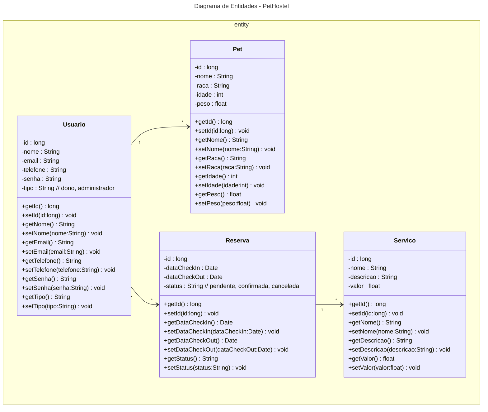

# Fábrica de Software 2025
Nome: Pedro Henrique Placidina Maria

# Proposta de Projeto

⦁	PetHostel
  *  CADASTRO DE ANIMAIS
  *  AGENDAMENTO DE RESERVAS PARA O PET
  *  HISTORICO DE RESERVAS
  *  CADASTRO DE USUARIOS
    
<s>
 
⦁	Organizador de Estudos
  * CADASTRO DE DISCIPLINAS
  * ADICAO DE TAREFAS
  * CALENDARIO INTEGRADO

</s>

 ## Aula 05/08   

  - JRE - Java Runtime Enviroment
    - Ambiente minimo para executar um programa Java
    - JVM - Java Virtual Machine (java.exe ou javam.exe)

  - JDK - Java Development Kit
    - Ambiente de DESENVOLVIMENTO (javav.exe) compilador

  - COMPILACÃO
    1) Escreve um programa em java (arquivo.java)
    2) Compilação arquivo.java -> javac.exe -: bytevode
    arquivo.class
  - EXECUÇÃO
    3) Passar .class -> java.exe (JVM) -> ling maquina

### Aula 12/08
- História de Usuarios
    - Como um dono de pet, eu quero registrar os dados do meu animal (nome, raça, idade, peso), para que o hotel tenha as informações necessárias para cuidados adequados.
- Registro do dono 
    - Como um dono de pet, eu quero me cadastrar no sistema com meus dados (nome, telefone, e-mail), para que eu possa fazer reservas e ser identificado no sistema.
- Criar Reserva 
    - Como um dono de pet, eu quero agendar uma hospedagem (check-in/check-out e selecionar serviços), para garantir a estadia do meu pet com serviços desejados.
- Verificação de Disponibilidade 
    - Como um funcionário, eu quero visualizar a ocupação diária do hotel, para evitar aceitar reservas quando o limite for atingido.
- Histórico de Reservas 
    - Como um dono de pet, eu quero consultar minhas reservas passadas e futuras, para acompanhar estadias anteriores e próximas.
- Relatório de Hospedagem Atual 
    - Como um funcionário, eu quero ver todos os pets hospedados atualmente, para saber quem está no hotel no momento.
  
## Aula 19/08
## Diagrama de entidades

- [Extensão Mermaid](https://marketplace.visualstudio.com/items?itemName=vstirbu.vscode-mermaid-preview)
- [Mermaid ClassDiagram](https://github.com/mermaid-js/mermaid/blob/develop/packages/mermaid/src/docs/syntax/classDiagram.md)

| Type    | Description   |
| ------- | ------------- |
| `<\|--` | Inheritance   |
| `*--`   | Composition   |
| `o--`   | Aggregation   |
| `-->`   | Association   |
| `--`    | Link (Solid)  |
| `..>`   | Dependency    |
| `..\|>` | Realization   |
| `..`    | Link (Dashed) |

  

    
